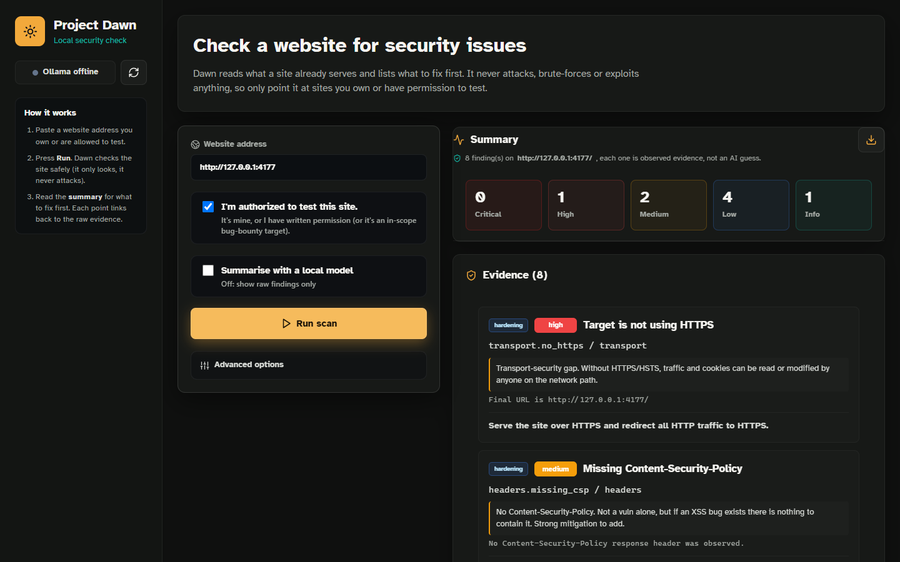

# Project Dawn

A website security checker that runs on your own machine. You give it a site you own or have permission to test, and it reads what the site already serves: response headers, cookies, forms, the HTML and the JavaScript bundles. It then lists what it found, how serious each item is and how to fix it. It never sends attack payloads to public sites.

If you have [Ollama](https://ollama.com) running, a local model can write a short summary on top of the findings. The model only sees the evidence the scanner collected and is told not to go beyond it. Without Ollama you still get the full list of findings.



## What it checks

| Area | Examples |
| --- | --- |
| Transport | HTTPS, HSTS, redirects |
| Headers | CSP, clickjacking protection, referrer and permissions policies, CORS |
| Cookies and forms | missing `HttpOnly`/`Secure`/`SameSite`, forms posting over HTTP |
| Page content | mixed content, source maps, sensitive comments, API routes in the bundle |
| JavaScript | DOM XSS sinks, unguarded `postMessage` handlers, hard-coded keys |
| Exposed files | `.env`, `.git/config`, database dumps, Swagger and GraphQL endpoints |
| Versions | server and framework versions checked against end-of-life dates |

A few active checks exist for testing your own lab setup. They only run against `localhost` or private network addresses.

Each finding comes with the raw evidence it was based on, and every scan can be downloaded as a Markdown report.

## Running it

```bash
npm ci
npm run dev
```

Open http://localhost:4177. For summaries, install Ollama and pull a model:

```bash
ollama pull dolphin3:8b-llama3.1-q4_K_M
```

Any other installed model can be picked in the UI, and `OLLAMA_BASE_URL` points it at a different Ollama host.

## Long-running agent

There is also a command-line agent that works through a bigger question in many short model calls, saving each step to a Markdown file so small local models don't lose track:

```bash
npm run agent:long -- --goal "Review the scanner architecture and propose improvements" --iterations 25
```

It can only edit project files with `--allow-project-edits` and only run shell commands with `--allow-shell`. `.env` files, `.git` and `node_modules` are always off limits.

## Layout

| Path | Contents |
| --- | --- |
| `server/scanner` | the checks and the scan runner |
| `server/agents` | Ollama client and the file-backed agent loop |
| `server/reports` | Markdown report output |
| `src` | React UI |
| `docs` | architecture and safety notes |
| `data` | scans, reports and agent workspaces (git-ignored) |

## Use it responsibly

Only scan systems you own or have written permission to test. This is a learning project for defensive checks and it doesn't replace a proper security assessment.
