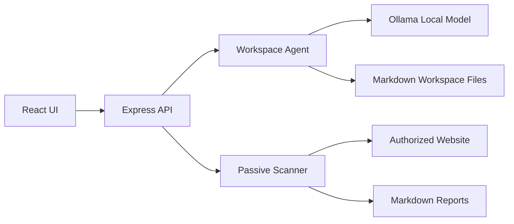

# Project Dawn Architecture

## Goals

Project Dawn is built around a practical constraint: smaller local models often lose quality when forced to solve a large task in one response. The workspace agent breaks work into short passes and persists each pass as a Markdown file.

The security scanner is defensive by design. It starts with passive checks and produces evidence, severity, and remediation guidance without attempting exploitation.

## Runtime View



## AI Workspace Flow

1. The user submits a question, target URL, model name, session ID, authorization state, modules, and file-pass count.
2. The server creates or reuses `data/workspaces/<session-id>/`.
3. The original question is written to `00-question.md`.
4. In assessment mode, the passive scanner runs first and writes scan evidence, findings, and a report into the workspace.
5. Each model pass reads the existing Markdown files and asks the local model for one concise artifact based on the actual evidence.
6. The UI displays the files so the user can inspect and reuse the work.

The notes are not intended to expose private hidden reasoning. They are external artifacts: plans, facts, assumptions, risks, checks, conclusions, and next steps.

## Scanner Flow

1. The user enters a target URL and confirms authorization.
2. The server makes a single bounded GET request with redirects enabled.
3. Passive modules inspect response metadata and limited HTML.
4. Findings are normalized into `id`, `module`, `severity`, `evidence`, and `remediation`.
5. A Markdown report is generated and saved.

Current modules cover transport, headers, cookies, forms, mixed content, injection surfaces, client secrets, stack exposure, client assets, dangerous exposure paths, and guarded active lab probes.

## Scanner Module Contract

Each check exports an analyzer with this shape:

```js
export async function analyzeExample(context) {
  return [
    {
      id: "example.finding_id",
      title: "Human-readable title",
      severity: "low",
      evidence: "Observed signal",
      remediation: "Recommended fix"
    }
  ];
}
```

The shared context contains:

```js
{
  targetUrl,
  finalUrl,
  status,
  headers,
  rawHeaders,
  html
}
```

## Model Strategy

Start with an instruction-tuned local model that is good at structured output. For the first iteration, Ollama models are enough because the workspace loop reduces context pressure.

Recommended path:

1. Use prompt discipline and file-backed memory first.
2. Add retrieval over trusted web-security references and your own remediation playbooks.
3. Collect labeled examples from authorized test apps.
4. Evaluate the model on known cases before training.
5. Fine-tune only when retrieval and prompts no longer solve the gap.

## Memory Management

- Limit model context by truncating previous notes before each pass.
- Limit scan response body reads to a fixed byte budget.
- Keep reports as files instead of in-memory history.
- Keep scanner checks stateless and independent.
- Avoid storing sensitive cookie values in reports.

## Defensive Boundary

This prototype avoids active exploitation, credential attacks, bypass logic, destructive requests, brute force, fuzzing, and payload injection. Active checks should only be added behind target allowlists, rate limits, written authorization records, and clear module labeling.
